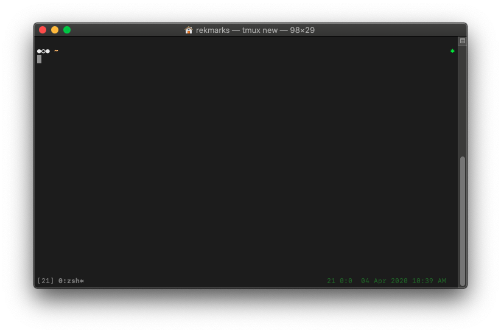

# 🛠 dotfiles

## Usage

- Platform
  - **macOS**
- For reloading `.zshrc` without restarting
  - `so`
  - Note that `exit` and restart is recommended
- For reloading `.vimrc` without restarting vim
  - `:so ~/.vimrc`
- To migrate dotfiles
  - `yarn m`

## Recovery

- First, install:
  - `homebrew` from [brew.sh](https://brew.sh)
    - Upon completion, run `brew install yarn`
    - Other `homebrew` packages will be installed automatically.
  - Oh My ZSH!
    - `sh -c "$(curl -fsSL https://raw.githubusercontent.com/ohmyzsh/ohmyzsh/master/tools/install.sh)"`
  - [nvm](https://github.com/nvm-sh/nvm#installing-and-updating)
  - [Visual Studio Code](https://code.visualstudio.com/Download)
- Then, attempt automatic reinstall:
  - `yarn install:fresh`
  - If the script fails, see contents for manual steps.
- Finally:
  - In a running instance of `nvim`
    - `:PlugInstall`
    - `:so ~/.vimrc` or restart `nvim`
  - GPG signing
    - Download and install [GPG Tools](https://gpgtools.org/)
    - Follow [these instructions](https://help.github.com/en/articles/managing-commit-signature-verification) to generate a new key.
      - Old GPG keys can be reused if they were managed appropriately.
    - Run the following git commands:
      - `git config --global user.signingkey <YOUR-SIGNING-KEY-PUB-ID>`
      - `git config --global commit.gpgsign true`

### Gotchas

- `pyenv`
  - Check that the desired versions are listed in `scripts/install/install_python.sh`
  - Sometimes after updating, you have to run `pyenv rehash` to properly update PATH
- `ssh`
  - SSH requires some manual setup, even after generating new keys. See [here](https://docs.github.com/en/enterprise-server@3.5/authentication/connecting-to-github-with-ssh/generating-a-new-ssh-key-and-adding-it-to-the-ssh-agent#adding-your-ssh-key-to-the-ssh-agent).

## Packages & Frameworks

- [Homebrew](https://brew.sh)
- [nvm](https://github.com/nvm-sh/nvm#installing-and-updating)
- [Neovim](https://neovim.io/)
  - [vim-plug](https://github.com/junegunn/vim-plug)
- [NVM](https://github.com/nvm-sh/nvm)
- [Oh My ZSH!](https://ohmyz.sh/)
- [pyenv](https://github.com/pyenv/pyenv)
  - [pyenv-virtualenv](https://github.com/pyenv/pyenv-virtualenv)
- [tmux](https://github.com/tmux/tmux/)
  - [TPM](https://github.com/tmux-plugins/tpm)
